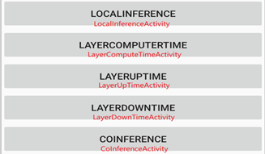
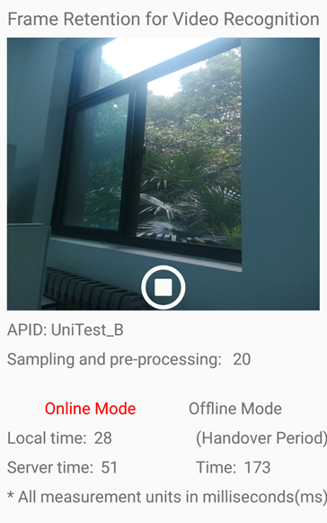

# DNN-Inference-Optimization

## 项目介绍

该项目针对端边协同执行DNN模型推断的场景，设计链式和非链式DNN模型的自适应DNN模型拆分和协同推断方案，有效解决现有方案拆分粗粒度和单一化等问题，利用动态规划方法获得近似最优拆分策略。进一步设计兼顾设备负载和任务特性的DNN模型计算时延预测模型，首次加入空闲CPU时间、内存占用率等设备负载变化相关的特征，评估多种常见的回归模型，能够在设备负载变化的真实场景中准确预测不同DNN模型的计算时延。此外，设计并实现DNN模型的端边协同推断框架，对DNN模型计算时延预测、模型拆分和协同推断策略进行真实验证。

## 环境配置与说明

本程序分别由服务器端程序和客户端程序组成，开发语言与环境各不相同。

服务端使用Python作为开发语言，建议使用anaconda作为Python的包管理软件，IDE建议采用PyCharm，具体开发环境配置如下：

| **Environment**                     | **Description**                                           |
| ----------------------------------- | --------------------------------------------------------- |
| Develop operating  system           |                                                           |
| Integrated  Development Environment | PyCharm                                                   |
| Development  language               | Python3.7.4及以上                                         |
| Dependent library                   | Keras,tensorflow,networksx,scilit-learn,    numpy, socket |

客户端使用Android作为开发语言，IDE建议采用Android Studio,具体开发环境配置如下：

| **Environment**                     | **Description**                                              |
| ----------------------------------- | ------------------------------------------------------------ |
| Develop operating  system           |                                                              |
| Integrated  Development Environment | Android  Studio3.5.3                                         |
| Development  language               | Java1.8                                                      |
| Dependent library                   | Andriod  SDK8.0,gson2.6.2,  tensorflow-android1.5.0,openCVLibrary344 |

## 代码介绍

- 计算延迟预测模型

  DNN层计算延迟预测模型代码位于ct_prediction_model路径下。

  数据采集工具：每个类型的DNN网络层都需要采集自己的推理训练数据，采集数据的代码都为：. ct_prediction_model/xxx/RunxxxLatencyData.py。执行后生成xxx_train.csv文件。

- DNN模型实现与导出

  模型实现：实验中采用的14个DNN模型实现代码位于： models/xxx/文件夹下的xxxModel.py。执行方式：python xxxModel.py

  模型导出：模型部署分成两个部分，一个是运行在服务器端的模型的导出，一个是安卓手机上的模型导出。14个DNN模型的实现与模型导出代码都以相同的方式组织，都是models/xxx/文件夹下的TrainXxx.py。执行方式：python TrainXxx.py。执行后生成的模型文件中，model.h5文件是运行在服务器端的模型，用Python代码读入可执行推理；xxx_model.pb文件是可以运行在安卓手机上模型文件。

- 端边节点时间计算

  边缘节点计算时间：代码位于： models/xxx/文件夹下的xxxModel.py。执行方式：python xxxTimeCount.py。执行后生成EdgeNodeComputeTime.txt文件。

  移动节点计算时间：代码位于:  android/app/src/main/java/aflak/me/tensorflowlitexor/LayerComputeTimeActivity.java。执行后生成MobileNodeComputeTime.txt。

  移动设备每层上载传输延迟统计：代码位于: android/app/src/main/java/aflak/me/tensorflowlitexor/LayerUpTimeActivity.java。执行后生成MobileNodeUploadTime.txt。

  移动设备每层下载传输延迟统计：代码位于: android/app/src/main/java/aflak/me/tensorflowlitexor/LayerDownTimeActivity.java。执行后生成MobileNodeDownloadTime.txt。

- DNN分区算法

  基于DP的非链式DNN分区算法和DADS分区算法以及NeuroSurgeon分区算法的代码位置分别如下：

  MyDNNPartition.py

  DADSPartition.py

  NeurosurgeonPartition.py

## 运行与样例

- 运行

  客户端与服务端之间使用socket通信。

  客户端:

  安卓代码位于：android文件夹下。

  安卓客户端的界面比较简单，如下所示，重要信息都打印在log日志中，注意观察日志。界面中每个button和Android代码Activity文件的对应关系如下：

  

  ​	对应Activity代码所在位置：android/app/src/main/java/aflak/me/tensorflowlitexor/xxx.java。

  ​	服务端:

  ​	安卓端上述功能中的【移动设备每层上载传输延迟统计】、【移动设备每层下载传输延迟统计】和【协作	推	理执行】，在运行前，需要提前启动服务端程序。服务端程序代码位置如下：

  ​	TargetNetUpTime.py

  ​	TargetNetDownTime.py

  ​	server.py

- 样例

  系统有两种推理模式：（1）离线模式（Offine Mode），即手机端在断网的条件下，独自进行推理任务，“Time”为推理时间。（2）在线模式（Online Mode），即手机端与服务端通过网络连接通信，协同进行推理任务，“Local Time”为手机端本地推理部分任务所需时间，“Server Time”为手机端发送数据时间、服务器推理任务时间与手机端接收结果的时间。“Local Time”和“Server Time”的和为手机端与服务端协同推理的时间。

  

  ​	下表为不同时长视频的两种模式推理时间及失帧情况。	

| Video duration | Offline   | Online        |           |      |
| -------------- | --------- | ------------- | --------- | ---- |
| InferenceTime  | DropFrame | InferenceTime | DropFrame |      |
| 5s             | 3033ms    | 36            | 3619ms    | 15   |
| 10s            | 9640ms    | 97            | 8147ms    | 23   |
| 15s            | 13505ms   | 149           | 10069ms   | 41   |
| 20s            | 17967ms   | 198           | 12658ms   | 59   |

 